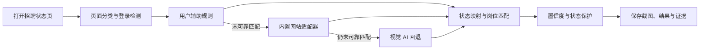

# 职迹优化说明

本文记录职迹当前已经实现的重要优化、设计取舍和使用边界，便于后续维护、排障和继续演进。

## 1. 浏览器进程与资源占用

### 1.1 优化目标

旧版 Runner 会为每一次自动检查、识别预览和人工登录分别启动 Edge，任务结束后立即关闭。这样隔离性较好，但连续检查时会反复支付浏览器初始化、组件加载和进程回收成本。

当前版本改用两个按需浏览器池：

| 浏览器池 | 用途 | 启动时机 | 空闲回收 | 主动轮换 |
| --- | --- | --- | --- | --- |
| 自动检查池 | 页面检查、截图、识别预览 | 第一个任务到达时 | 90 秒 | 30 个任务 |
| 登录池 | 可见的人工登录窗口 | 检测到需要登录时后台预热 | 180 秒 | 30 个任务 |

浏览器不会永久常驻。任务连续到达时复用 Edge 进程；队列空闲后自动关闭，以在响应速度和内存占用之间取得平衡。

### 1.2 任务隔离

复用的是 Edge 主进程，不是任务页面。每个任务都会创建独立的 `BrowserContext`：

- Cookie、缓存和站点存储不会在任务之间直接串用。
- 每个 Context 可以使用自己的代理设置。
- 任务完成或取消后立即关闭 Context 和其中的页面。
- 登录状态通过加密浏览器状态显式传递，不依赖长期保留的明文浏览器用户目录。

### 1.3 登录预热

自动检查发现登录页后，Runner 会在后台启动登录专用 Edge，但暂不创建可见页面。用户随后点击登录时，只需要创建 Context、打开页面并导航，不再等待完整的 Edge 冷启动。

如果用户没有进行登录，预热进程会在 180 秒空闲期后自动退出。

### 1.4 异常与长期运行

- Edge 意外退出后，浏览器池会丢弃失效实例，下一个任务重新启动。
- 创建 Context 失败时，会关闭故障实例并自动重试一次。
- 每处理 30 个任务主动轮换浏览器，降低长期运行后的内存增长风险。
- 桌面程序退出时，自动检查池和登录池都会一起关闭。
- 浏览器磁盘缓存继续受 512 MB 上限约束。

### 1.5 Windows 进程归属

Windows 任务管理器默认按应用类型和窗口分组，不一定按父子进程树显示 Node.js、Edge 和 WebView2。桌面版因此额外使用 Windows Job Object 管理后台进程：

- API 和 Runner 两个 Node.js 进程启动后立即加入主程序持有的 Job Object。
- Runner 后续启动的 Edge 进程及其渲染器、GPU 和 Utility 子进程继承该 Job。
- Job 设置 `JOB_OBJECT_LIMIT_KILL_ON_JOB_CLOSE`。
- 主程序正常退出、异常退出或崩溃导致 Job 句柄关闭时，Windows 内核统一终止其中仍存活的后台进程。
- 现有主动关闭和等待逻辑继续保留，Job Object 作为最终兜底。

Job Object 约束的是实际生命周期和资源归属，不保证任务管理器界面一定将所有进程折叠显示在主程序节点下。

## 2. 浏览器状态持久化

系统按站点加密保存以下浏览器状态：

- Cookie。
- localStorage。
- IndexedDB。

IndexedDB 支持常见对象、数组、日期、正则表达式、Map、Set、BigInt、ArrayBuffer、TypedArray、Blob 和 File。为防止站点缓存或离线数据导致状态文件无限膨胀，每个 Object Store 最多保存 1000 条记录。

恢复流程为：

1. 在导航前安装 Cookie 和 localStorage。
2. 首次进入目标 Origin。
3. 恢复该 Origin 的 IndexedDB 数据。
4. 如果确实恢复了 IndexedDB，则刷新页面，让网站按完整状态重新初始化。

浏览器状态使用现有状态加密密钥保存，不会把登录数据明文写入长期浏览器 Profile。

## 3. 规则工作台

规则工作台用于为内置适配器尚未覆盖的招聘网站创建本地 DOM 解析规则，减少对视觉 AI 的依赖。

### 3.1 工作流程

1. 从检查组中选择一个岗位并加载页面。
2. 在脱敏截图上点选岗位标题和当前状态。
3. 选择页面布局：岗位列表或进度条。
4. 设置 Hostname、Pathname URLPattern 和优先级。
5. 生成规则草稿。
6. 执行无写入测试，确认岗位和状态能够可靠匹配。
7. 保存并启用规则。

### 3.2 隐私与安全

规则只保存路径和稳定 DOM 特征，不保存：

- 输入框内容。
- Cookie 或令牌。
- 完整 HTML。
- 完整页面文本。
- 页面截图。

### 3.3 匹配顺序

启用的用户规则按 URLPattern 具体程度和规则优先级排序。规则无效、过期或无法可靠匹配时，会安全回退到内置解析器或 AI，不会阻断整个检查任务。

规则支持启用、停用、删除、单条导出、批量导出和 JSON 导入。导入时会跳过冲突或无效规则。

## 4. 状态映射

状态映射把招聘网站中的明确文字映射到统一的申请进度，例如初筛、面试、录用和淘汰。

主要特性：

- 每个状态可以配置多条中英文关键词。
- 每行填写一个词条。
- 同一词条不能同时分配给两个状态。
- 保存后，本地 DOM 解析和 AI 提示词会立即共同使用。
- 支持恢复内置映射。

状态映射采用明确关键词匹配，不进行模糊匹配，也不会自行猜测相近词义。这样可以降低相似词、页面说明文字或其他岗位状态造成的误判。

## 5. 本地解析与 AI 回退

检查流程优先使用确定性更强、成本更低的本地解析：

当前内置本地适配器覆盖北森、Moka 和飞书。用户规则可以扩展其他网站；AI 用于本地规则无法可靠处理的页面。

## 6. 状态保护

为了避免自动识别覆盖可信的人工判断，系统包含以下保护：

- 人工锁定的状态不会被普通自动检查随意覆盖。
- 登录页、官网、空白页等非状态页面会被单独分类。
- 岗位标题必须能够可靠匹配当前检查组中的岗位。
- 低置信度或证据不足的结果不会直接作为高可信状态写入。
- 识别结果保存对应截图、原始状态和证据，便于复核。

## 7. 后续可调参数

浏览器池的空闲时间和轮换任务数目前采用保守默认值。后续可以根据实际设备内存和任务规模考虑：

- 在设置页开放“低内存 / 平衡 / 高性能”档位。
- 低内存设备缩短空闲回收时间。
- 大批量检查时延长自动检查池存活时间。
- 记录浏览器启动耗时、任务耗时和异常退出次数，用实际数据调整默认值。
