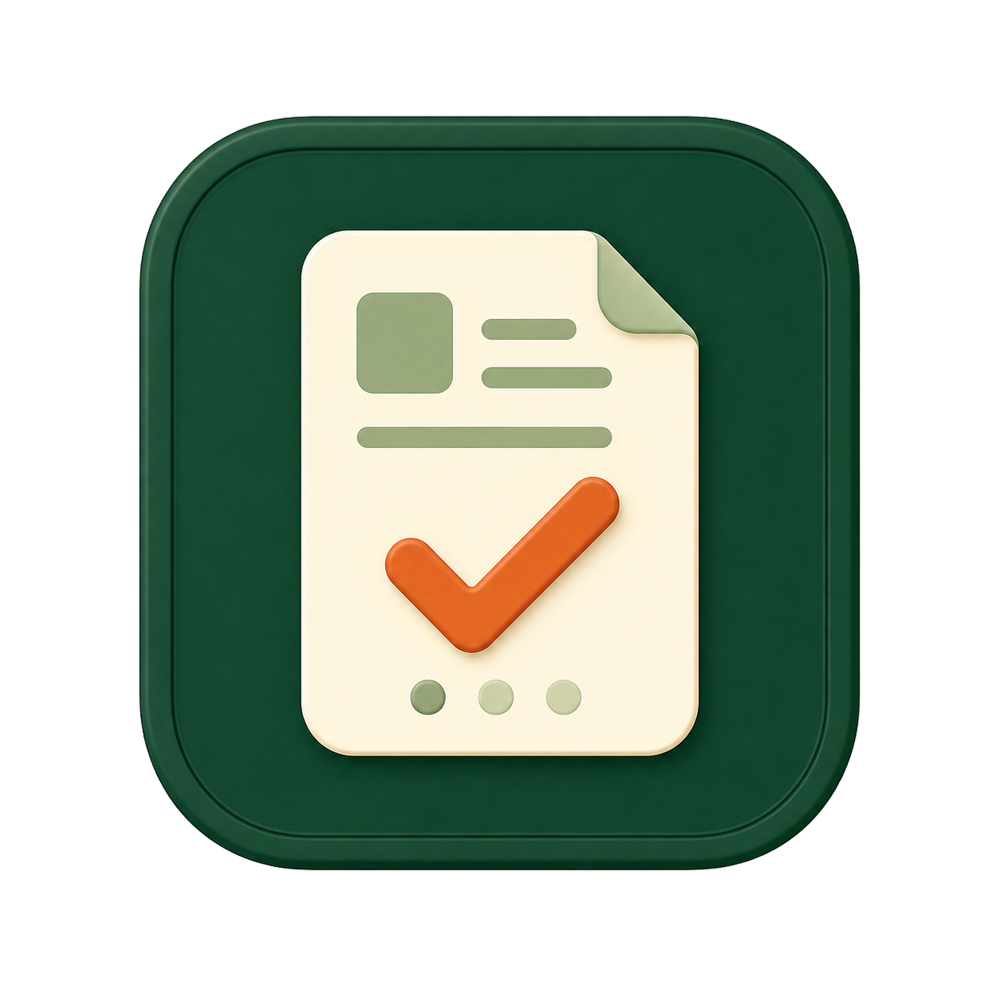

<div align="center">
  
  <h1>职迹 · Application Checker</h1>
  <p>本地优先的求职申请管理与招聘网站状态检查工具</p>
  <p>
    
    
    
    
  </p>
</div>

## 项目简介

职迹是一个面向个人用户的本地应用，用来记录岗位、管理投递进度，并按计划自动打开招聘网站检查申请状态。

应用会复用加密保存的 Cookie、localStorage 和 IndexedDB，保存完整网页截图，并可选用 OpenAI-compatible 视觉模型识别页面中的申请状态。所有业务数据默认保存在本机，不需要云端数据库。

## 主要功能

- 管理公司、岗位、投递日期、地点、状态页、招聘页和备注
- 搜索、状态筛选、批量检查及任务历史
- 按公司和状态页自动组成检查组，减少重复截图和 AI 调用
- 支持全局、自定义和手动 Cron 检查计划
- 使用 SQLite 保存岗位、运行记录、通知、浏览器状态和设置
- 自动截取完整网页，支持截图保留天数和到期清理
- 加密保存招聘网站 Cookie、localStorage、IndexedDB 和 AI API Key
- 通过规则工作台扩展本地 DOM 解析，并支持自定义状态映射
- 自动检查与人工登录使用独立工作通道；自动检查支持 1–3 路并发，登录 Edge 空闲 30 分钟内复用并在超时后自动释放
- 登录失效时提供人工登录流程
- 人工状态锁定、AI 自动识别、置信度阈值和状态变更通知
- Docker 版和 Windows WebView2 便携桌面版

浏览器资源策略、本地解析链路、规则工作台和状态映射的设计说明见 [OPTIMIZATIONS.md](OPTIMIZATIONS.md)。

## 选择运行方式

| | Docker 版 | Windows 桌面版 |
|---|---|---|
| 适用场景 | 长期后台运行、开发或服务器部署 | 普通 Windows 用户、本地日常使用 |
| 系统要求 | Docker Engine / Docker Desktop | Windows 10/11 x64、Edge、WebView2 |
| 浏览器 | 容器内 Chromium | 系统 Microsoft Edge |
| 人工登录 | 应用内 noVNC 窗口 | 独立 Edge 登录窗口 |
| 数据目录 | 仓库根目录 `data` | EXE 同级 `data` |
| Node/.NET 依赖 | 由容器提供 | 已内置，无需用户安装 |

## Docker 版

### 环境要求

- Docker Engine 和 Docker Compose v2
- Windows 用户推荐使用 Docker Desktop 或 WSL2

### 启动

1. 创建本地配置：

   ```bash
   cp .env.example .env
   ```

2. 修改 `.env` 中的两个密钥。不要在真实使用中保留示例值：

   ```bash
   openssl rand -hex 32
   openssl rand -base64 32
   ```

   第一条结果用于 `RUNNER_INTERNAL_TOKEN`，第二条结果用于 `STATE_ENCRYPTION_KEY`。

3. 构建并启动：

   ```bash
   docker compose up -d --build
   ```

4. 打开 <http://127.0.0.1:8080>。

应用端口只绑定到 `127.0.0.1`。Runner、VNC 和 WebSocket 仅位于 Docker 内部网络。

### 常用命令

```bash
# 查看状态
docker compose ps

# 查看日志
docker compose logs -f

# 停止
docker compose down

# 更新代码后重新构建
docker compose up -d --build
```

Docker 版数据保存在仓库根目录的 `data`。执行 `docker compose down` 不会删除这些数据。

### 使用 GitHub Container Registry 镜像

仓库会在 `main` 分支更新或推送 `v*` 版本标签时，将 API/Web 与 Runner 多架构镜像发布到 GHCR：

- `ghcr.io/bluewhale235/application-checker:latest`
- `ghcr.io/bluewhale235/application-checker-runner:latest`

无需克隆源码构建时，下载 `docker-compose.ghcr.yml` 和 `.env.example`，创建并填写 `.env`，然后运行：

```bash
docker compose -f docker-compose.ghcr.yml pull
docker compose -f docker-compose.ghcr.yml up -d
```

默认使用 `latest`。设置 `IMAGE_TAG=v0.0.9` 可以固定版本。首次发布后，如 GHCR Package 默认为私有，需要在 GitHub Package 设置中将两个镜像改为 Public；私有镜像则需要先执行 `docker login ghcr.io`。

### 在桌面版与 Docker 之间迁移数据

设置页的“数据迁移”可以导出或导入 `.acbackup` 全量加密备份。备份包含岗位、检查记录、规则、设置、截图、浏览器登录状态和 AI API Key，但不包含日志、缓存、临时文件以及 `STATE_ENCRYPTION_KEY`。

导出时需要设置迁移密码，导入端使用同一密码解密。敏感数据会先由来源端 Key 解密，再使用目标端当前的 `STATE_ENCRYPTION_KEY` 重新加密，因此桌面版和 Docker 不需要使用相同 Key，也不应为了导入而修改 `docker-compose.yml`。

Docker 的 Key 必须与 `data` 目录一起长期保管，推荐写入未提交的 `.env` 或 Docker Secret。程序会记录 Key 的不可逆指纹；如果数据目录中已有加密数据但 Key 被修改，启动时会明确报错。导入采用全量覆盖且不会自动备份目标数据，请在确认页核对数据数量。

## Windows 桌面版

### 环境要求

- Windows 10 或 Windows 11 x64
- Microsoft Edge
- Microsoft Edge WebView2 Runtime
- Microsoft .NET 10 Desktop Runtime x64

桌面版基于 .NET 10 WPF 和 WebView2。便携包采用 framework-dependent 发布，不携带 .NET/WPF Runtime；它仍自带 Node.js、API、Runner 和前端资源，不包含业务 `node_modules`，也不需要 Docker、WSL 或系统 Node.js。

如果未安装 .NET 10 Desktop Runtime，双击 EXE 时 .NET AppHost 会显示缺失框架信息和官方下载链接。也可以提前执行：

```powershell
winget install Microsoft.DotNet.DesktopRuntime.10
```

### 使用便携版

1. 从 GitHub Releases 下载 `ApplicationChecker-portable-win-x64.zip`。
2. 解压到具有写入权限的普通目录，不要直接放入受保护的 `Program Files`。
3. 双击 `ApplicationChecker.exe`。

应用产生的全部可变数据都位于 EXE 同级的 `data`：

```text
data/
├─ application-checker.sqlite
├─ screenshots/
├─ runtime-settings.json
├─ desktop-settings.json
├─ webview2/
├─ browser/
├─ logs/
└─ tmp/
```

移动或备份整个应用目录即可同时迁移程序和数据。桌面版不会自动读取 Docker 版的 `data`，也不应让两个版本同时操作同一个数据库。

### 从源码构建桌面版

构建机需要：

- Node.js `v24.18.0` LTS
- pnpm `11.2.2`
- .NET 10 SDK
- PowerShell（Windows PowerShell 或 Linux 上的 PowerShell 7）

```powershell
pnpm install
pnpm desktop:build
```

默认构建版本从仓库根目录的 `app-version.json` 读取。需要临时指定其他版本时可直接调用脚本：

```powershell
./desktopApp/build-portable.ps1 -BuildVersion v0.1.0
```

脚本可以在 Windows 上原生构建，也可以在 Linux 上交叉生成 Windows x64 便携包。Linux 构建会把 `better-sqlite3` 重建为 Windows x64 原生模块，并在打包前检查其 PE 文件头。

输出文件：

```text
desktopApp/artifacts/ApplicationChecker-portable-win-x64.zip
```

构建脚本会完成类型检查、测试、Web/API/Runner 构建、压缩后的 ncc bundle、.NET 10 framework-dependent 发布和 ZIP 打包。版本号会编译进 Web 的 `__APP_VERSION__` 常量，并显示在设置页。Node 版本必须与脚本中的固定版本一致，以保证 `better-sqlite3` 原生模块 ABI 兼容。

## AI 状态识别

AI 功能完全可选。可以在“设置 → AI 状态识别”中配置兼容 OpenAI Chat Completions 视觉输入格式的服务。

可以在 AI 设置中启用“深度思考”。启用后请求会优先携带 `reasoning_effort: high`；如果模型或兼容服务以 400/422 拒绝深度参数，应用会自动改用普通模式重试，并在本次服务进程中记住该模型不支持深度思考。

| 配置 | 说明 | 默认值 |
|---|---|---|
| `AI_BASE_URL` | OpenAI-compatible API 地址 | 空 |
| `AI_API_KEY` | API Key | 空 |
| `AI_MODEL` | 视觉模型名称 | 空 |
| `AI_CONFIDENCE_THRESHOLD` | 自动应用结果的最低置信度 | `0.75` |

API Key 使用 AES-256-GCM 加密保存。未配置 AI 或模型调用失败时，截图任务仍会正常完成。

对于同一个检查组，应用只提交一次截图，并要求模型按岗位 ID 返回结构化结果。未匹配、低置信度、人工锁定或暂停自动化的岗位不会被自动修改。

## 规则工作台

规则工作台支持两种互斥的本地识别方式：

- **点选规则**：新建时加载招聘页面截图，依次点选岗位标题和当前状态，生成稳定的 DOM 定位规则。
- **页面脚本**：适合需要填写姓名/手机号、点击查询，或同页包含多个岗位等复杂页面。脚本可读取只读的 `application`、`applications`，并使用 `helpers` 操作页面。

已有点选规则点击“编辑”后会直接使用绿色主题的 Monaco Editor 打开规则定义 JSON，可修改 `hostname`、`pathname`、`container`、`title` 和 `status` 等字段。编辑器支持行号、搜索、折叠、格式化、括号匹配和 JSON 语法诊断；现有规则解析器仍会检查规则版本和必填字段，保存时 API 还会校验 URLPattern、定位器长度及不安全内容。直接编辑 JSON 不会重新执行页面测试。点选规则保存后会保持当前编辑状态，并显示“已保存”，由用户手动关闭或切换规则。

### 编辑页面脚本规则

点击脚本规则卡片中的“编辑”后，会打开覆盖整个应用的脚本工作区：左侧使用 Monaco Editor 编辑 JavaScript，测试结果、岗位映射和调试输出固定在编辑器下方；右侧集中显示规则设置、投递字段和当前页面投递。点击投递字段会在当前光标位置插入 `application.<field>`。Monaco 支持行号、搜索替换、括号配对、格式化和错误提示；命令面板等内置界面使用中文，`application`、`applications`、`helpers` 会以专用颜色高亮，并提供中文自动补全与悬浮说明。

规则工作台和编辑器均按需加载。Monaco 的 JavaScript、JSON、CSS 与语言服务 Worker 随便携版发布，仅在当前 WebView 会话首次打开相应编辑器时加载，因此离线也能使用；访问首页或只使用页面点选流程时不会加载 Monaco。关闭编辑区域会销毁当前 editor、model、类型声明和监听器；已经下载到 WebView 会话中的异步分包可以在下次打开时复用。

脚本模式加载页面后会在 Runner 中保留一个隐藏的 Edge 页面，连续点击“运行测试”将复用当前页面状态，不再重复启动浏览器、导航、截图或提取整页快照。需要恢复页面初始状态时可再次点击“加载页面”。关闭脚本工作区、切回点选规则、离开规则工作台，或页面空闲 10 分钟后会自动释放该页面；脚本异常、超时、跳转到规则域名之外或进入登录页时也会立即释放。应用同时最多保留一个脚本预览页面，以限制内存占用。保存脚本规则后编辑器会保持打开，方便继续测试和调整。

脚本工作区支持 `Ctrl/Cmd + S` 保存、`F1` 命令面板、`Shift + Alt + F` 格式化。关闭、按 `Esc` 或切换回点选规则时，如有未保存修改会先要求确认。

脚本工作区右上角会显示“已保存”或“未保存”状态。脚本规则保存成功后不会自动关闭编辑器，而是在原位置切换为“已保存”并刷新规则列表，由用户决定何时关闭。测试结果区域可以独立收起和展开；新的测试结果返回时会自动展开，收起后只保留状态、耗时和展开按钮，将空间还给代码编辑器。

除 JavaScript 代码外，还可以修改：

- 规则名称；
- `Hostname URLPattern` 和 `Pathname URLPattern` 匹配范围；
- 规则优先级；
- 脚本总执行超时；
- 保存后的启用状态。

编辑器会即时检查规则名称、Hostname、Pathname 和脚本是否为空，并要求总执行超时为 `1000` 到 `60000` 毫秒之间的整数。达到总超时后会关闭当前浏览器页面并终止本次脚本结果，避免失控脚本长期占用浏览器资源。`waitForSelector`、`waitForText` 和 `waitForTextChange` 的单次等待参数同样最多为 60 秒；单次等待时间不应超过规则的总执行超时。

保存策略会区分元数据和可执行定义：

- 仅修改规则名称、优先级或启用状态时，可以直接更新，无需重新运行页面脚本；
- 修改 JavaScript、Hostname、Pathname 或总执行超时后，可以直接保存；“运行测试”仍可用于验证当前页面和投递数据，但不再是保存前置条件；
- 新建脚本规则也可以先保存后测试，测试不会修改岗位状态，也不会发送通知；
- 测试结果只用于显示当前脚本的验证时间和诊断状态，不会阻止规则更新。

右侧“规则设置”区域会提示当前修改能否直接保存，或是否需要重新测试。这样既方便修改展示名称等普通信息，也避免未经验证的脚本或执行范围直接生效。

脚本编辑器工具栏提供“API 文档”入口。弹窗可搜索并查看 `application`、`applications` 的全部只读字段，所有 `helpers` 方法的调用签名、等待限制和使用示例，以及脚本返回值结构与大小限制，无需离开规则工作台查询源码。

页面脚本可通过 `helpers.currentUrl()` 获取当前完整地址，并使用 `helpers.goto(url)` 跳转到同一规则 hostname 范围内的其他页面。跳转完成后脚本会从开头重新执行，因此应先判断当前地址以避免循环；单次执行最多允许 3 次跳转，跳转与重新执行共同受规则总超时限制。

自定义招聘域名可以通过 `helpers.routeAdapter(adapterId)` 交给内置平台适配器识别。当前支持 `beisen`、`mokahr` 和 `feishu`；该方法不会跳转页面，必须作为脚本的唯一返回值。未配置的域名返回空数组后，会继续现有的本地识别与 AI 回退链：

```js
/** @type {Record<string, "beisen" | "mokahr" | "feishu">} */
const domainAdapters = {
  "career.company-a.com": "beisen",
  "jobs.company-b.com": "mokahr",
  "talent.company-c.com": "feishu"
};

const hostname = new URL(helpers.currentUrl()).hostname.toLowerCase();
const adapterId = domainAdapters[hostname];
return adapterId ? helpers.routeAdapter(adapterId) : [];
```

路由只是选择识别器，不会直接判定成功。内置适配器仍需可靠匹配岗位标题和状态；北森会优先调用投递记录接口，未完整识别的岗位再由北森 DOM 解析补充。

`helpers.axios` 提供 Axios 风格的 `get`、`post`、`put`、`patch`、`delete` 和配置对象调用方式，支持查询参数、请求头、JSON 请求体、超时、响应类型及 `withCredentials`。请求在当前 Edge 页面网络环境中发出，可以访问任意 HTTP(S) 地址，但仍遵循浏览器的 CORS、CSP、Cookie 与 SameSite 策略；默认只向同源请求携带 Cookie。禁止脚本主动设置 `Cookie`、`Host`、`Origin`、`Referer` 和 `Sec-*` 请求头，请求体最多 256KB，响应体最多 2MB。

```js
if (!helpers.currentUrl().includes("/history")) {
  await helpers.goto("/history");
}

const { data } = await helpers.axios.get("/api/application/status", {
  params: { id: application.id },
  timeout: 8000
});
```

规则工作台左侧列表在搜索过滤后按更新时间降序展示，并在启用状态左侧显示更新时间。该展示顺序不会改变正式检查时按规则优先级进行的匹配顺序。

页面脚本可以通过 `helpers.log(...values)` 输出临时调试信息：

```js
helpers.log("开始查询", application.jobTitle);
const rawStatus = helpers.text(".status");
helpers.log("读取状态", { rawStatus });
```

测试通过状态、岗位识别结果、调试输出和错误信息统一显示在代码编辑器下方，并按相对时间展示日志；即使脚本随后报错或超时，也会尽量保留终止前已经产生的日志。每次测试最多保留 100 条、单条 2KB、总量 32KB。调试日志只存在于内存预览记录中，不写入数据库、应用日志或通知，正常自动检查结束后会直接丢弃。

### 页面脚本直接返回岗位状态

不需要读取页面状态文本时，可以用 `helpers.status()` 直接生成返回结果。该结果不会再次经过状态文本映射：

```js
return helpers.status("screening", {
  evidence: "页面显示简历正在筛选"
});
```

支持的状态为 `unset`（未设置）、`screening`（初筛）、`screening_passed`（已过初筛）、`interview_pending`（待面试）、`interviewed`（已面试）、`signing_pending`（待签约）、`offer`（已收 OFFER）、`rejected`（淘汰）和 `needs_login`（需要登录）。`needs_login` 会把本次检查归类为需要登录；`unset` 可以把岗位状态直接改回未设置。脚本必须 `return` 返回值才会生效。

同页多岗位时传入岗位 ID：

```js
return applications.map((item) => helpers.status("screening", {
  applicationId: item.id,
  evidence: `${item.jobTitle} 正在筛选`
}));
```

如果同一检查组中的多个岗位需要返回相同状态，可以使用 `helpers.statusAll()`：

```js
if (helpers.currentUrl().includes("login")) {
  return helpers.statusAll("needs_login", {
    evidence: "当前页面需要登录"
  });
}
```

`statusAll()` 会为当前检查组的全部岗位生成结果；`helpers.status()` 仍然只返回一个岗位结果。

脚本还可以通过 `helpers.error()` 或 `helpers.errorAll()` 返回可控的岗位错误。错误岗位会保留当前状态、停止后续内置与 AI 识别，并生成失败通知；省略原因时会自动附带脚本行号。混合返回中的正常岗位结果仍会照常应用：

```js
return applications.map((item) => item.jobTitle.includes("暂停招聘")
  ? helpers.error("该岗位暂时无法查询", { applicationId: item.id })
  : helpers.status("screening", { applicationId: item.id }));
```

### 在页面脚本中嵌入点选 JSON

点选规则可以一键写入页面脚本，也可以手动把工作台导出的点选规则 JSON 交给 `helpers.runSelectorRule()`：

```js
const selectorRule = {
  schemaVersion: 2,
  kind: "selector",
  hostname: "careers.example.com",
  pathname: "/*",
  container: null,
  title: { tag: "div", role: null, classes: ["job-title"], dataStatus: null, ariaCurrent: null, ariaSelected: null, ancestorTags: [] },
  status: { tag: "span", role: null, classes: ["status"], dataStatus: null, ariaCurrent: null, ariaSelected: null, ancestorTags: [] }
};

const results = helpers.runSelectorRule(selectorRule);
helpers.log("点选 JSON 结果", results);
return results;
```

该 API 复用点选规则的定位和岗位匹配语义，只返回标题与状态都唯一的岗位；没有匹配、存在歧义或地址范围不匹配时返回空数组，随后继续使用内置识别和 AI 回退。规则工作台中的“写入页面脚本”只创建草稿，保存时会沿用原规则 ID 将点选类型替换为脚本类型，并要求先测试通过；转换前不会修改原点选规则。

## 代理

通过 `UPSTREAM_PROXY_URL` 可以让自动检查浏览器使用上游代理：

```env
UPSTREAM_PROXY_URL=http://127.0.0.1:7890
```

Docker 版需要保证该地址能从 Runner 容器访问；不要在容器配置中直接使用只对宿主机有效的 `127.0.0.1` 代理地址。

## 本地开发

### 环境要求

- Node.js 24 LTS
- pnpm 11

```bash
pnpm install
pnpm dev
```

- Web 开发服务器：<http://127.0.0.1:5173>
- API：<http://127.0.0.1:8080>

单独启动本机 Runner：

```bash
pnpm dev:runner
```

### 质量检查

```bash
pnpm typecheck
pnpm test
pnpm build
```

## 技术架构

```text
apps/
├─ web/       Vue 3 + Vuetify 前端
├─ api/       Fastify API、SQLite、调度与静态资源服务
└─ runner/    Puppeteer 浏览器检查、登录与截图

packages/
├─ contracts/     共享类型与校验模型
├─ cookie-state/  浏览器状态处理
└─ ai-status/     AI 状态识别

desktopApp/       .NET 10 WPF + WebView2 桌面外壳
```

核心技术：

- Vue 3、Vue Router、Vuetify、Vite
- Fastify、Kysely、better-sqlite3
- Puppeteer Core、Chromium / Microsoft Edge
- .NET 10 WPF、Microsoft Edge WebView2
- Docker Compose、Xvfb、x11vnc、noVNC

## 安全与隐私

- Web 服务默认只监听 `127.0.0.1`
- Runner 内部接口使用独立 Bearer Token
- 桌面版每次启动生成独立会话凭据保护本地 API
- Cookie、localStorage、IndexedDB 和 AI API Key 使用 `STATE_ENCRYPTION_KEY` 加密
- 招聘网站截图只在配置 AI 后发送给指定的 AI 服务
- 请妥善备份密钥；丢失 `STATE_ENCRYPTION_KEY` 后无法恢复已加密的登录状态
- 不要提交 `.env`、`data`、截图、数据库或发布产物到 Git

## 故障排查

### Docker

```bash
docker compose ps
docker compose logs app
docker compose logs runner
```

如果页面可打开但任务一直排队，优先检查 Runner 日志和 `/api/health`。

### Windows 桌面版

- 构建：
```
pnpm run desktop:build
```
- 前端、API、RUNNER构建：
```
pnpm run desktop:build:internal
```

- API 日志：`data/logs/api.log`
- Runner 日志：`data/logs/runner.log`
- 桌面外壳日志：`data/logs/desktop.log`

如果提示本地服务启动失败，错误窗口会显示日志的绝对路径和末尾内容。确保应用目录可写、Edge/WebView2 可用，并且没有另一个“职迹”实例正在运行。

## 页面路由

- `/applications`：投递进度
- `/tasks`：任务管理
- `/browser-profiles`：浏览器状态
- `/settings`：全局、浏览器和 AI 设置
